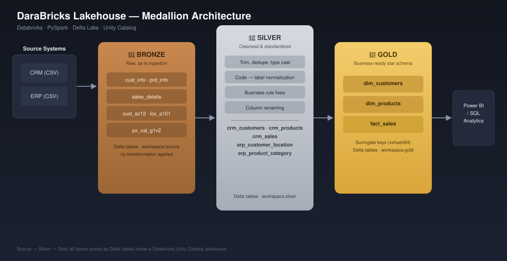
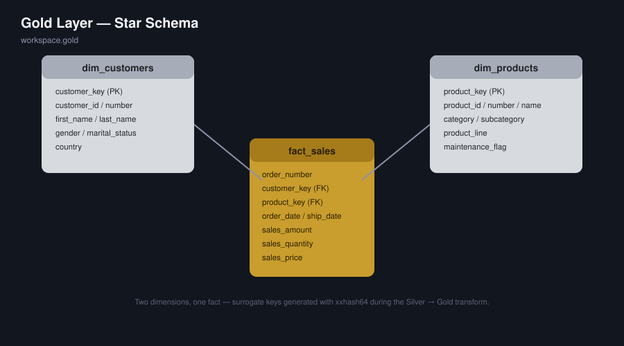

# 🚴 DaraBricks — Bike Sales Lakehouse

[](https://www.databricks.com/)
[](https://spark.apache.org/docs/latest/api/python/)
[](https://delta.io/)
[](LICENSE)

A modern **Lakehouse** built on Databricks that turns raw CRM and ERP CSV exports from a bike retailer into a business-ready **star schema**, using the **Medallion Architecture** — Bronze → Silver → Gold — with PySpark, Delta Lake, and Unity Catalog.

This is a portfolio project: it demonstrates end-to-end data engineering (ingestion, cleansing, modeling) on a lakehouse stack, in contrast to the traditional SQL Server data warehouse approach.

---

## 🏗️ Architecture



1. **🥉 Bronze** — Raw data landed as-is from CRM and ERP CSV files into Delta tables. No transformations; this is the immutable source of truth.
2. **🥈 Silver** — Cleansing, standardization, and business-rule fixes: trimming, deduplication, type casting, code-to-label normalization (e.g. `M` → `Married`, `DE` → `Germany`), and invalid-date handling.
3. **🥇 Gold** — Business-ready **star schema**: two dimensions and one fact table, with surrogate keys generated via `xxhash64`, ready to be queried directly by Power BI or SQL.

---

## 📖 Project Overview

This project covers:

1. **Lakehouse Architecture** — Medallion design (Bronze/Silver/Gold) on Databricks, backed by Delta Lake and Unity Catalog.
2. **ETL Pipelines** — PySpark notebooks extracting, transforming, and loading data from two source systems.
3. **Data Modeling** — Dimensional modeling (star schema) optimized for analytical queries.
4. **Analytics-Ready Output** — Gold tables designed to plug directly into Power BI / SQL analytics.

🎯 Built to demonstrate practical skills in:
- Lakehouse & Medallion Architecture
- PySpark / Spark SQL data engineering
- Delta Lake & Unity Catalog
- Data Modeling (star schema, surrogate keys)
- Data Quality & Cleansing

---

## 🛠️ Tech Stack

| Tool | Purpose |
|---|---|
| **Databricks** | Lakehouse platform — compute, notebooks, orchestration |
| **PySpark** (DataFrame API + `pyspark.pandas`) | Ingestion and transformation logic |
| **Spark SQL** | Gold-layer transformation queries and sanity checks |
| **Delta Lake** | Storage format for all Bronze/Silver/Gold tables |
| **Unity Catalog** | Catalog/schema governance (`workspace.bronze` / `.silver` / `.gold`) |
| **Power BI** | Downstream consumption of the Gold star schema |

---

## 📂 Repository Structure

```
DaraBricks_Project/
│
├── bike_lakehouse/
│   ├── Bronze/
│   │   └── bronze.ipynb                       # Ingests CRM + ERP CSVs into Delta (as-is)
│   │
│   ├── Silver/
│   │   ├── CRM/
│   │   │   ├── Silver_CRM_Customer_Info.ipynb  # Cleansed customer master data
│   │   │   ├── Silver_CRM_Product_info.ipynb   # Cleansed product master data
│   │   │   └── Silver_CRM_Sales.ipynb          # Cleansed sales transactions
│   │   └── ERP/
│   │       ├── Silver_ERP_Customers.ipynb      # ERP customer demographics
│   │       ├── Silver_ERP_Customer_Location.ipynb  # Country standardization
│   │       └── Silver_ERP_Product_Category.ipynb   # Category / subcategory
│   │
│   └── Gold/
│       ├── Gold_Dim_Customers.ipynb            # dim_customers (CRM + ERP merged)
│       ├── Gold_Dim_products.ipynb             # dim_products (CRM + ERP merged)
│       └── Gold_Fact_Sales.ipynb               # fact_sales (joined to both dims)
│
├── docs/
│   ├── data_architecture.svg                   # Medallion architecture diagram
│   ├── data_model.svg                          # Gold-layer star schema
│   ├── data_catalog.md                         # Table & column-level documentation
│   ├── naming_conventions.md                   # Naming rules for schemas/tables/columns
│   └── requirements.md                         # Project objectives & scope
│
├── README.md
└── LICENSE
```

---

## ⭐ Gold Layer — Star Schema



Full column-level documentation is in [`docs/data_catalog.md`](docs/data_catalog.md).

| Table | Grain | Description |
|---|---|---|
| `gold.dim_customers` | One row per customer | CRM master data merged with ERP demographics & country |
| `gold.dim_products` | One row per active product | CRM product key parsed and joined to ERP category/subcategory |
| `gold.fact_sales` | One row per order line | Sales transactions linked to both dimensions via surrogate keys |

---

## 🔍 Data Quality Highlights

A sample of the cleansing rules applied in Silver, documented in full per table in the [data catalog](docs/data_catalog.md):

- Deduplication and null-key filtering on customer records.
- Regex-based parsing of composite keys (e.g. splitting category code out of the CRM product key).
- Code-to-label normalization for gender, marital status, product line, and country.
- Defensive date parsing — invalid or zero-length date codes are nulled instead of breaking the load.
- Sales amount recalculation when the source value is missing or inconsistent with `quantity × price`.

---

## 🚀 Reproducing This Project

1. Create a Databricks workspace (the free/Community Edition works) with Unity Catalog enabled.
2. Upload the source CSVs to a Unity Catalog volume, e.g. `/Volumes/workspace/bronze/data_sources/source_crm/` and `.../source_erp/`.
3. Run the notebooks in order: `Bronze` → `Silver/CRM` + `Silver/ERP` → `Gold`.
4. Connect Power BI (or any SQL client) to the Databricks SQL warehouse and point it at `workspace.gold.*`.

---

## 🙋 About Me

I'm **Shehab**, a Computer Science student and Data Analyst / BI Developer based in Cairo, working with Power BI, DAX, Power Query, and ETL/star-schema modeling. This project is part of my portfolio, applying data warehousing concepts on a modern Lakehouse stack.

## 🛡️ License

This project is licensed under the [MIT License](LICENSE).
